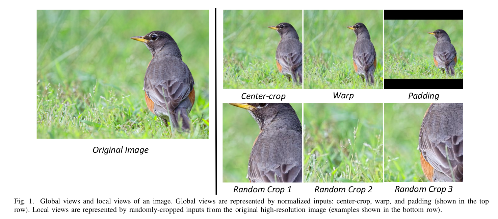

*This is a simple file to keep track of my progress, but the proper report will be written in latex.*

-------------------

**Monday, 19. December 2016 01:08pm **

So far I only used the provided features, excluding those that could not be directly converted to be nurmeric. I tried a simple random forest on that (0.43) and boosting (0.506).

**Samedi, 24. décembre 2016 04:22 **

Began to look at the pictures and the detected faces. Some pictures are in black and white (no 3rd dimension in numpy) and some other are in colors. Extract faces with the given position, width and height, resize them to be 100*100 and export them as images to the extracted_faces folder.

**dimanche, 25. décembre 2016 12:16 **

Random forest on face pixels (100*100) => 0.45

**lundi, 26. décembre 2016 12:01 **

Trained a CNN from scratch (reusing the tutorial from tensorflow deep mnist) on the extracted faces and reached about 0.50 score (about the same as with boosting) without much care about the learning rate.

=> next idea: push the CNN, fine tuning and/or get an embedding to put the features in the boosting along the meta features. 

**samedi, 07. janvier 2017 12:32 **

*In between*

So far I tried 2 approach on the faces: using Keras tutorial as a starter I fine tuned the last layers of the vgg16 but in each case I never managed to get scores higher that 0.45. Maybe I didn't train the network efficiently or the architecture is too big and/or there is a limit in the extracted faces themselves.

I had to duplicate the black and white channel to 3 RGB channels to make the architecture work so this is perhaps not the best way also.

**samedi, 07. janvier 2017 05:49 **

*Today*

I fitted a small convnet that uses both the faces (2 conv layers + 1 dense) but also the meta-features that are introduced at the end of the network with a parallel dense layer. The dense layers from both parts are merged and passed to a last dense layer.

WIth the same data than before I reach about 0.50. UPDATE: using 9500 training examples and testing on 500 (before I used only 7k for training) I get up to 0.58.

=> using more data leads to better results but I need to check what boosting can do with all the training data and also what the CNN with only the faces can achieve.

UPDATE:: I checked on the CNN with faces only and got about 0.5 only. But the train/testing I used for the 0.58 were not randomized and by keeping randomly 500 for testing I get 0.55. Using Boosting on 9500 training data and 500 testing ones I get about 0.48. No improvement.

**dimanche, 08. janvier 2017 02:23 **

Reading the paper: 

Lu, Xin, et al. "Rating Image Aesthetics Using Deep Learning." IEEE Transactions on Multimedia 17.11 (2015): 2021-2034.

To handle different sizes of input images: center-crop, padding...

Also there's this interresting article: [understanding-aesthetics-deep-learning](https://devblogs.nvidia.com/parallelforall/understanding-aesthetics-deep-learning/) 

I worked on pre-processing today, in the flavour of Lu, Xin, et al.: 
	- extracted global views of image using **crop-centering** + **rescaling** to end up with **500x500x3** inputs =>13 000 items, totalling 441,4 MB
	- extracted 10 randomly chose **200x200 local views** per image => 130 000 items, totalling 670,9 MB
	
 *ISSUE: a few picts are black and white and it's a shame to discard RGB for all others just because of them...*